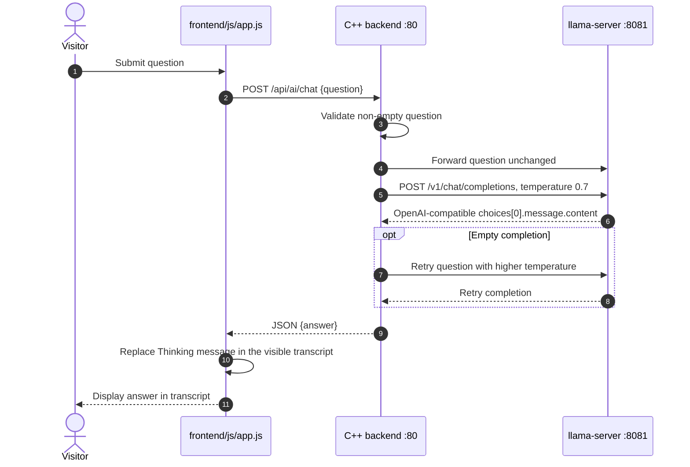
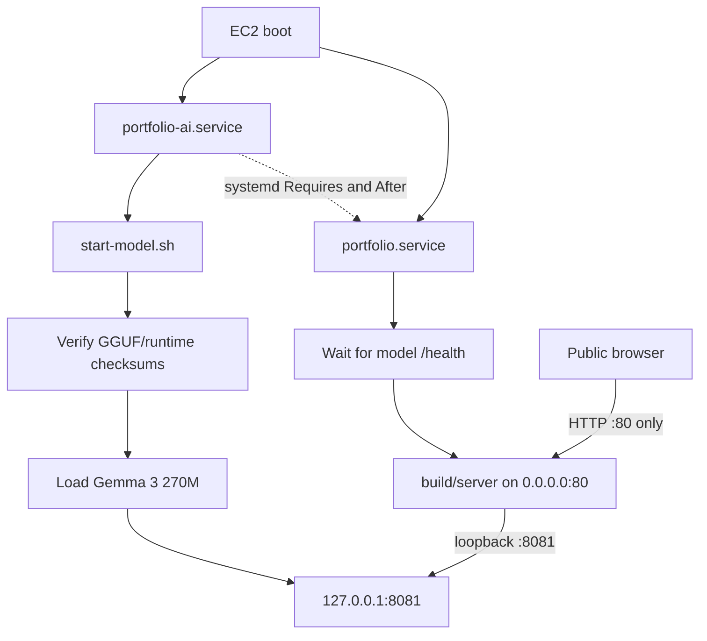

# Project Architecture & Developer Guide

This document serves as the master architectural reference for human developers and AI coding agents working on this project.

---

## 1. System Overview

This application is a **high-performance, zero-clutter C++ microservice** powering a dynamic Single Page Application (SPA).

- **Backend**: Lightweight, multithreaded C++17 server built on `cpp-httplib`, compiled directly with `g++` (`O3` optimized).
- **Frontend**: Theme-agnostic Vanilla JavaScript (SPA) paired with decoupled, structure-first CSS.
- **Networking**: Dual-stack IPv4/IPv6 network listener bound to `0.0.0.0` (accessible across local Wi-Fi / LAN).
- **Caching**: Developer-friendly `no-store` cache headers for instant frontend visual feedback on edits.

---

## 2. Core Architectural Rules (STRICT CONSTRAINTS)

When modifying or expanding this repository, **all AI assistants and human developers MUST adhere to the following rules**:

### Rule 1: Zero Hardcoded Styling in JavaScript or HTML
- **HTML (`index.html`)** and **JavaScript (`app.js`)** MUST ONLY emit semantic HTML structure, CSS class names, and element-level IDs.
- **NEVER** write inline `style="..."` attributes or hardcoded color/layout values in DOM-generating JavaScript functions.

### Rule 2: 100% Presentational & Positional Independence in CSS
- **Visual Presentation**: Theme colors, fonts, glassmorphism, borders, hover states, and animations MUST be defined exclusively in CSS files (`style.css`, `styleSTRUCTURE.css`, etc.).
- **Positional Ordering**: Section order, component flow, header item positioning, and grid layouts MUST be controllable purely via CSS using CSS Grid Areas (`grid-template-areas`) or Flexbox ordering (`order: N;`).

### Rule 3: Dynamic Data API Integration
- Page content is served via `/api/data` (populated from `data.json`).
- Live coding statistics (LeetCode, GitHub, Codeforces) are served via `/api/stats` proxied securely by the C++ backend.

---

## 3. Directory & File Blueprint

```
.
├── backend/
│   ├── include/          # C++ header files & SecurityMiddleware
│   ├── src/              # Server execution logic & API controllers
│   └── third_party/      # Embedded single-header libraries (nlohmann/json, httplib)
├── AI_backend/
│   ├── start-model.sh     # Downloads/verifies artifacts and starts local Gemma
├── frontend/
│   ├── css/
│   │   ├── style.css             # Active stylesheet loaded by index.html
│   │   ├── styleSTRUCTURE.css    # Master developer blueprint (complete DOM selector skeleton)
│   │   └── styleTEST1.css        # Theme example demonstrating section reordering via CSS
│   ├── js/
│   │   ├── app.js                # Dynamic SPA DOM builder & data fetcher
│   │   └── security.js           # Client-side anti-tamper / inspection guard
│   └── index.html                # Semantic root HTML skeleton
├── data.json                     # Primary JSON dataset (Profile, Sections, Content)
├── CMakeLists.txt                # CMake build configuration
├── README.md                     # Setup, build, and run instructions
└── ARCHITECTURE.md               # Developer & AI reference guide (This document)
```

---

## 4. Selector & DOM Hierarchy Blueprint

Every element generated in the DOM carries explicit semantic IDs and classes for CSS targeting:

| DOM Element | Selector | Purpose |
| :--- | :--- | :--- |
| `<body>` | `#body`, `.page-body` | Global font, background, and page container |
| `<div>` | `#bg-layer`, `.bg-layer` | Fixed background layer for canvas/radial ambient glows |
| `<div>` | `#layout-wrapper`, `.layout-wrapper` | Main width container & page grid wrapper |
| `<header>` | `#header`, `.header-container` | Top header container |
| `<div>` | `.header-inner` | Flex column box holding title, bio, and social nav |
| `<h1>` | `#title`, `.title` | Owner / site title |
| `<p>` | `#subtitle`, `.subtitle` | Bio tagline / secondary title |
| `<nav>` | `#social-nav`, `.social-nav` | Social navigation wrapper |
| `<a>` | `.social-link` | Social channel pill buttons |
| `<main>` | `#main-content`, `.content-container` | Primary section grid wrapper |
| `<div>` | `#section-grid`, `.section-grid` | CSS Grid container holding cards |
| `<section>` | `.section-card` / `#section-card-${N}` | Individual content section cards |
| `<h2>` | `.section-title` | Section title heading |
| `<div>` | `.item-block` / `#item-block-${S}-${I}` | Entry block container |
| `<section>` | `#stats-section`, `.stats-section` | Live coding stats card banner |
| `<div>` | `.stats-box-grid` | Grid holding metric cells |
| `<div>` | `.stat-cell` | Metric card (number + label descriptor) |

---

## 5. How to Perform Common Tasks

### Task A: How to Change Component Layout & Section Order via CSS
To reorder sections on the page (e.g. moving Education to the bottom) without modifying JS or HTML:

```css
/* 1. Make the section grid a flex column */
#section-grid {
    display: flex;
    flex-direction: column;
    gap: 1.5rem;
}

/* 2. Set default order for all section cards */
.section-card {
    order: 1;
}

/* 3. Reorder specific section using its index ID */
#section-card-0 {
    order: 999 !important; /* Pushes Education section to the bottom */
}
```

### Task B: How to Swap Themes
1. Create a new stylesheet inside `frontend/css/` (e.g. `styleDARK.css`).
2. Copy the template selectors from `frontend/css/styleSTRUCTURE.css`.
3. Fill in your visual styles.
4. Overwrite `frontend/css/style.css` with your new stylesheet. Changes will reflect instantly without browser caching issues.

### Task C: How to Build & Run the Backend
```bash
# 1. Configure the CMake build
cmake -S . -B build

# 2. Compile the C++ microservice
cmake --build build

# 3. Start the local AI model in terminal 1
./AI_backend/start-model.sh

# 4. Start the website backend in terminal 2 (port 80 requires privilege)
sudo ./build/server
```
The website backend listens on `0.0.0.0:80` and serves `http://localhost/`. The local model listens only on `127.0.0.1:8081` and should not be exposed to the network.

---

## 6. Recommendations for Future Development

- **Adding Portfolio Content**: Add entries to `data.json` under `sections`. The existing `timeline` and `cards` types cover milestones, writing, solutions, resume links, and artwork; `app.js` renders them with semantic IDs (`#section-card-${index}`). Put standalone documents such as the resume in `frontend/` and link to them from the data. Set an action's `download` value to `true` to make its link download the file.
- **Adding Custom Styling Elements**: Use CSS pseudo-elements (`::before`, `::after`) inside theme stylesheets to create divider lines, accent borders, or bullet icons without cluttering the DOM.
- **HTTPS Enablement**: If deploying over public networks, update `backend/src/main.cpp` to use `httplib::SSLServer`.

## 7. Local AI Backend: Gemma, Context, and Request Lifecycle

### 7.1 Model Identity: Gemma, Not Gemini

The project does not call Google's hosted Gemini API. It runs Google's **Gemma 3 270M Instruct** model locally through `llama.cpp`:

- Model file: `AI_backend/google_gemma-3-270m-it-IQ3_XXS.gguf`.
- Parameter count: approximately 268 million; quantization: `IQ3_XXS`; downloaded file: about 225 MiB.
- Model distribution: a pinned GGUF from `bartowski/google_gemma-3-270m-it-GGUF`; its use is governed by Google's Gemma Terms of Use.
- Runtime: the pinned `llama.cpp` build `b11146`; CPU inference, one thread, one parallel slot, 8192-token context.
- Model API: OpenAI-compatible HTTP at `127.0.0.1:8081`; no Google API key is used.

The word *Gemini* usually refers to Google's hosted model/API family. This repository uses the related but distinct open-weight Gemma model. Its weights and inference are on the machine; the backend does not send chat prompts to Google. The model launcher needs internet access only when it must download a missing GGUF or llama.cpp runtime.

### 7.2 Model Startup, From Shell to Listening Socket

`AI_backend/start-model.sh` performs these steps in order:

1. Resolves its own directory, then names the GGUF and runtime paths relative to that directory. It does not rely on the caller's current directory for model files.
2. If the GGUF is missing, downloads the pinned Hugging Face revision to a temporary file, verifies its SHA-256, and only then moves it into place. It verifies the local GGUF checksum on every start.
3. If `llama-server` is missing, downloads the pinned llama.cpp Ubuntu x64 archive, verifies the archive checksum, and extracts it under `AI_backend/runtime/`.
4. Uses `exec` to replace the shell with `llama-server`. The process loads the GGUF and opens the OpenAI-compatible API at `127.0.0.1:8081`.

Important runtime options in the script are `--ctx-size 8192`, `--threads 1`, `--threads-batch 1`, `--parallel 1`, `--batch-size 16`, `--ubatch-size 16`, and `--no-webui`. The model port is bound to loopback, not `0.0.0.0`; the EC2 security group must not expose port 8081. The GGUF and runtime are Git-ignored artifacts, so a fresh EC2 clone downloads them at first startup.

The model runs with an 8192-token context. Each website chat request contains only the current question; portfolio data and earlier chat turns are not part of its prompt. The model is small, so answer quality is limited by its capabilities and training.

### 7.3 Stateless Chat Input

The AI chat route is intentionally isolated from the portfolio dataset:

- `data.json` remains in use by normal website APIs, but the `/api/ai/chat` handler does not read `dataService_`, `data.json`, or a context snapshot.
- No `portfolio_context.json` file is generated or read by the AI route.
- The model receives only the current question. A previous question or answer is never sent with the next request.
- The AI route does not inspect profile terms, filter question words, rank sections, or add portfolio-specific instructions.

### 7.4 Browser Chat Display

`frontend/js/app.js` displays only the current exchange:

- Each request body contains only `{ "question": "..." }`; no `history` property is sent.
- A new question clears the previous exchange before displaying the current question and answer.
- No transcript is persisted in browser storage or sent to the model. Refreshing clears the current exchange.

### 7.5 Chat Request: End-to-End Sequence



### 7.6 Request and Internal Modifications

The browser sends a request shaped like:

```json
{
    "question": "What is 1 + 2?"
}
```

The C++ backend validates that the question is non-empty and forwards the text as the single user message to `http://127.0.0.1:8081/v1/chat/completions`. It does not append portfolio data, prior chat, or a domain restriction. The request uses `temperature: 0.7`, `max_tokens: 128`, and `stream: false`; if the first completion is empty, it retries the same question at a higher temperature.

| Component | Internal responsibility |
| :--- | :--- |
| `AI_backend/start-model.sh` | Download/checksum model and runtime; launch Gemma with local-only binding and 8192 context. |
| `backend/src/GenericDataService.cpp` | Parse and cache canonical `data.json`; provide complete JSON to server/controllers. |
| `backend/src/Server.cpp` | Load website data for normal API routes, register routes, bind website server to port 80. |
| `backend/src/ApiController.cpp` | Validate the current question, send only that text to llama.cpp, retry an empty completion, and return the result. |
| `frontend/js/app.js` | Send only the current question and display the exchange in the page transcript. |

### 7.7 EC2 Startup and Service Dependencies

On EC2, the local model and the public website are separate `systemd` services. `portfolio-ai.service` starts `start-model.sh`; `portfolio.service` depends on it and waits for `127.0.0.1:8081/health` before starting the C++ server. This avoids exposing the model port and avoids serving a backend whose AI dependency is still loading.



The browser can reach only the website service on port 80. The C++ backend can reach the model service over loopback. On first boot, the model service may take several minutes to download its roughly 225 MiB GGUF and runtime before `/health` succeeds. EC2 provisioning details and service unit commands are in `EC2.md`.

### 7.8 Limits and Operational Checks

- `GET http://127.0.0.1:8081/health` should return `{"status":"ok"}` on the instance.
- Test local inference with `POST /v1/chat/completions`; opening that POST-only route in a browser produces a 404 and does not test inference.
- Test the website integration with `POST http://127.0.0.1/api/ai/chat` and a JSON body containing only `question`.
- A model connection/status failure returns HTTP 503. Empty questions return HTTP 400. Empty completions are retried once; a second empty completion returns HTTP 502.
- The model is local Gemma, not Gemini. It receives no portfolio or previous-chat data; response quality is limited by its 270M parameters and training.
- Keep port 8081 private. The launcher binds to `127.0.0.1`; only port 80 should be allowed inbound for the public website.
